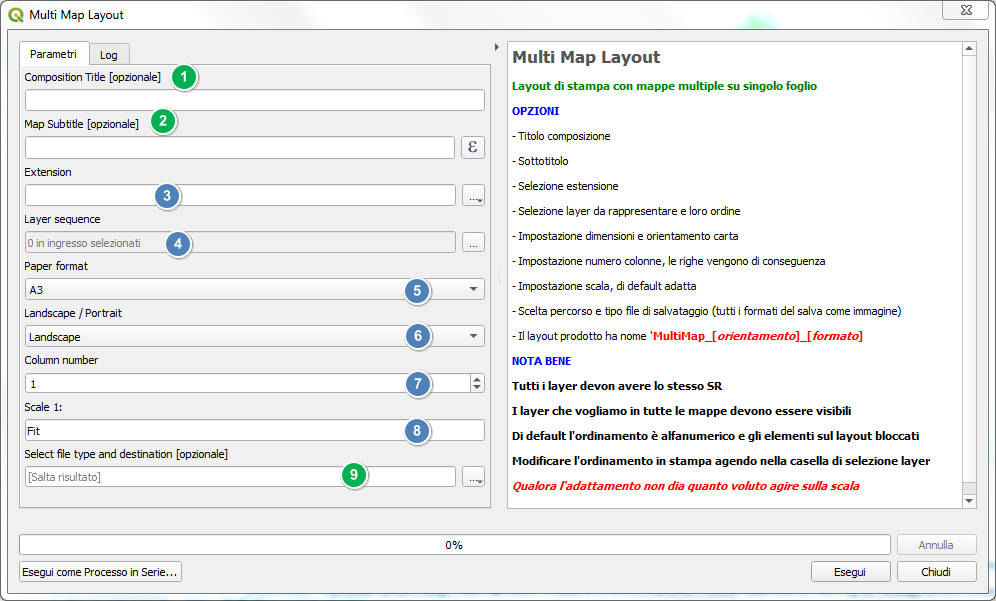

# Multiple Map
## QGIS Plugin per processing

Mappe multiple da elementi o layer su singolo layout
<!-- TOC -->

- [Multiple Map](#multiple-map)
  - [QGIS Plugin per processing](#qgis-plugin-per-processing)
    - [Installazione](#installazione)
    - [Finestra processing](#finestra-processing)
    - [Modifiche al layout prodotto](#modifiche-al-layout-prodotto)
      - [Layout d'esempio](#layout-desempio)
    - [Videotutorial](#videotutorial)
    - [Ringraziamenti](#ringraziamenti)

<!-- /TOC -->

### Installazione
Per installarlo basta che scarichiate lo zip del repo e da QGIS fate installa plugin da zip. 
E' disponibile nel repository ufficiale di QGIS.

### Finestra processing
Il plugin, una volta caricato, compare negli script di processing nella cartella HTML

Il plugin permette la composizione di un layot di pagina HTML con i layer da una fonte tra quelle compatibili.

1. [opzionale]Titolo che compare in testata del layout;
2. [opzionale]Sottotitolo;
3. Estensione della mappa comune a tutti i layer;
4. Sequenza dei layer da inserire;
5. Formato carta;
6. Orientamento carta;
7. Numero di colonne;
8. Scala;
9. File in uscita.

NOTA BENE: 

* Ogni mappa avrà per titolo il nome del layer corrispondente.

* Ogni mappa può avere un sottotitolo in comune con le altre

* E' possibile inserire una espressione di aggregazione tipo:

 `format_number(aggregate(layer:='comuni',aggregate:='sum',expression:="shape_area")/1000,2) || ' Ha' `

* questo a condizione che le mappe rappresentate abbiano i campi richiesti.

* L'estensione può essere scelta tra quelle dei layer disponibili, utilizzare quella della vista in essere o tracciata sul canvas.

* I campi selezionati possono essere riordinati a piacimento.

* E' possibile scegliere formato carta ed orientamento

* E' possibile salvare uno qualsiasi dei formati grafici previsti.

* Con layer con nomi duplicati la composizione potrebbe non riuscire, tipico caso layer memorizzati in gpgk provenienti da risultati processing.

* **TUTTI I LAYER DEVONO AVERE LO STESSO SR** dato che per costruzione devono risultare sovrapposti_

↑[torna su](#multiple-map)↑

### Modifiche al layout prodotto

Il layout prodotto potrebbe essere una versione definitiva, tuttavia, nella maggior parte dei casi è un punto di partenza, ogni modifica è possibile dal composer sbloccando i singoli oggetti e modificandoli opportunamente.
L'elemento scala è numerico e ripetuto per ogni mappa, come il sottotitolo, questo perchè si possono adattare tutte le mappe singolarmante.

E' anche possibile applicare un atlante contemporaneamente su tutte o parte delle mappe, così come inserire una mappa di riepilogo, legenda, ecc.

↑[torna su](#multiple-map)↑

#### Layout d'esempio

↑[torna su](#multiple-map)↑

### Videotutorial

↑[torna su](#multiple-map)↑

### Ringraziamenti
[QGIS.org](https://www.qgis.org/it/site/) - Tutti gli amici betatester

↑[torna su](#multiple-map)↑