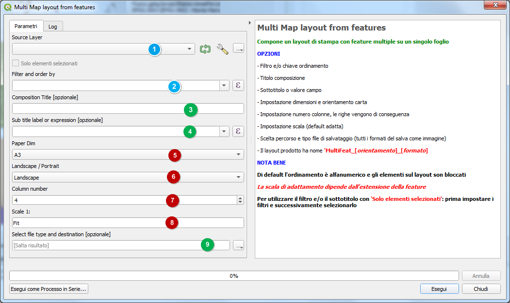
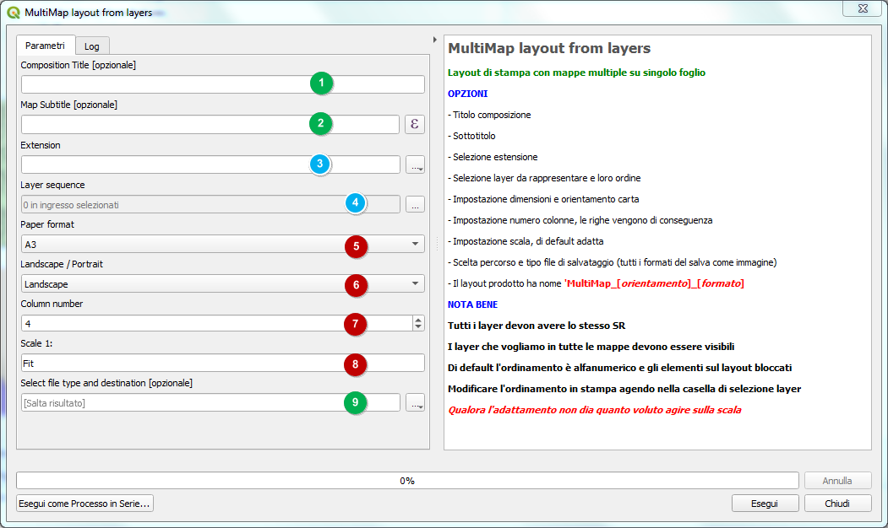
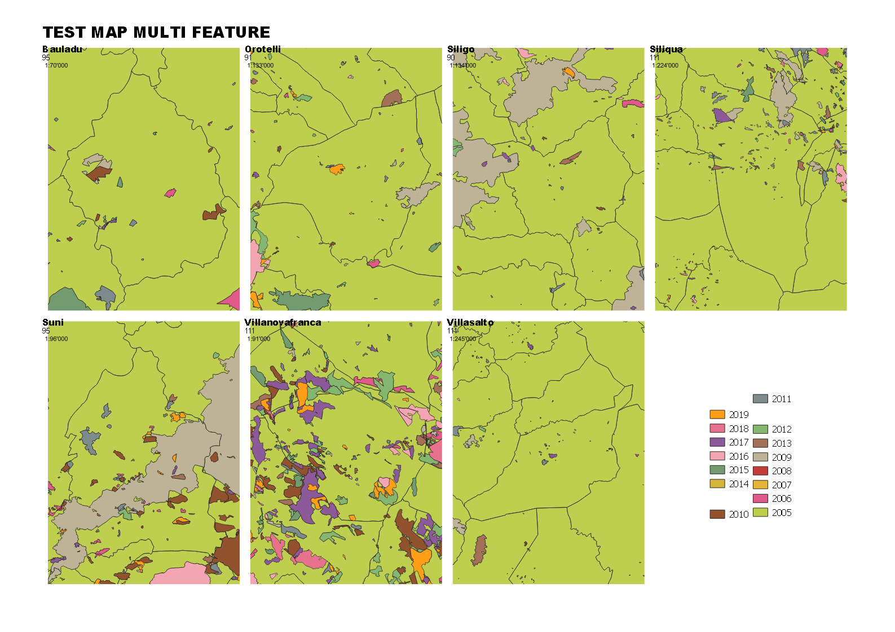
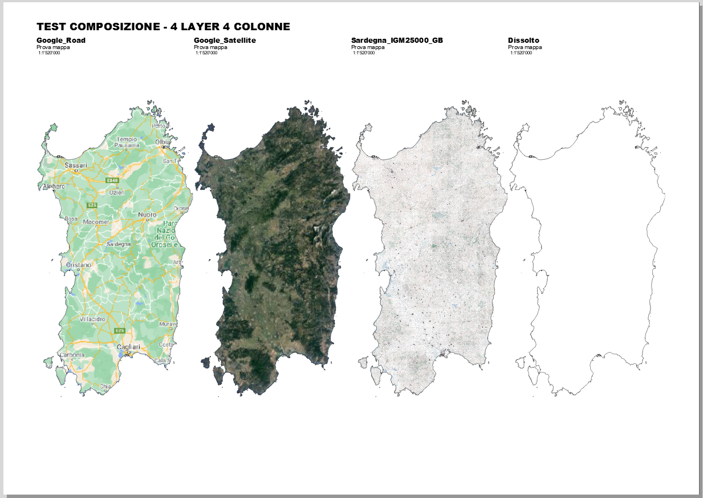
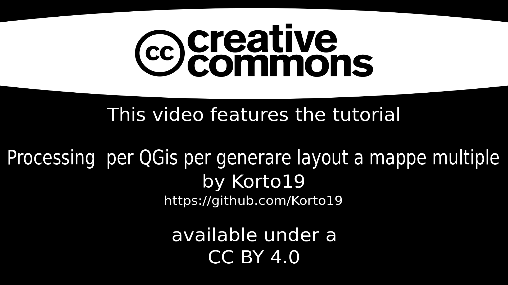

# Multiple Map
## QGIS Plugin per processing

Mappe multiple da elementi o layer su singolo layout
<!-- TOC -->

- [Multiple Map](#multiple-map)
  - [QGIS Plugin per processing](#qgis-plugin-per-processing)
    - [Installazione](#installazione)
    - [Finestra processing](#finestra-processing)
  - [MULTI MAP LAYOUT FROM FEATURES](#multi-map-layout-from-features)
  - [MULTI MAP LAYOUT FROM LAYERS](#multi-map-layout-from-layers)
  - [Modifiche ai layout prodotti](#modifiche-ai-layout-prodotti)
  - [Esempi](#esempi)
      - [Multimap da layer](#multimap-da-layer)
      - [Multimap da elementi](#multimap-da-elementi)
  - [Videotutorial](#videotutorial)
  - [Ringraziamenti](#ringraziamenti)

<!-- /TOC -->

### Installazione
Per installarlo basta che scarichiate lo zip del repo e da QGIS fate installa plugin da zip. 
A breve disponibile nel repository ufficiale di QGIS.

### Finestra processing
Il plugin, una volta caricato, compare negli script di processing nella cartella **Multi Maps**

Il plugin permette la composizione di un layout di pagina con i layer o gli elementi da una fonte tra quelle compatibili.

## MULTI MAP LAYOUT FROM FEATURES

1. Layer origine dati;
2. Filtro o ordinamento;
3. [opzionale] Titolo che compare in testa al layout;
4. [opzionale] Sottotitolo o espressione filtro;
5. Formato carta;
6. Orientamento carta;
7. Numero di colonne;
8. Scala;
9. File in uscita.
    

**NOTA BENE:** 

* Ogni mappa avrà per titolo il nome dell'elemento corrispondente.

* Ogni mappa può avere un sottotitolo dato da un campo o una espressione.
  
* Le mappe inserite ereditano la stessa visibilità del progetto.

* Per poter utilizzare i filtri con `'Solo elementi selezionati'` è necessario prima impostare i filtri e solo dopo spuntare `'Solo elementi selezionati'`.

* Il nome del layout prodotto sarà del tipo MultiFeat_Landscape_A + il formato o
 MultiFeat_Portrait_A + il formato. Ad esempio MultiFeat_Landscape_A3 se si è impostato come formato carta l'A3.

`
↑[torna su](#multiple-map)↑

## MULTI MAP LAYOUT FROM LAYERS

1. [opzionale]Titolo che compare in testata del layout;
2. [opzionale]Sottotitolo;
3. Estensione della mappa comune a tutti i layer;
4. Sequenza dei layer da inserire;
5. Formato carta;
6. Orientamento carta;
7. Numero di colonne;
8. Scala;
9. File in uscita.

**NOTA BENE:** 

* Ogni mappa avrà per titolo il nome del layer o dell'elemento corrispondente.

* Ogni mappa può avere un sottotitolo in comune con le altre.

* E' possibile inserire una espressione di aggregazione tipo:

 `format_number(aggregate(layer:='comuni',aggregate:='sum',expression:="shape_area")/1000,2) || ' Ha' `

questo a condizione che le mappe rappresentate abbiano i campi richiesti.

* L'estensione può essere scelta tra quelle dei layer disponibili, utilizzare quella della vista in essere o tracciata sul canvas.

* I campi selezionati possono essere riordinati a piacimento.

* E' possibile scegliere formato carta ed orientamento.

* E' possibile salvare uno qualsiasi dei formati grafici previsti.

* Con layer con nomi duplicati la composizione potrebbe non riuscire, tipico caso layer memorizzati in gpgk provenienti da risultati processing.

* **TUTTI I LAYER DEVONO AVERE LO STESSO SR** dato che per costruzione devono risultare sovrapposti.
  
* Geometrie errate possono dare luogo a errori.

* Il nome del layout prodotto sarà del tipo MultiMap_Landscape_A + il formato o
 MultiMAp_Portrait_A + il formato. Ad esempio MultiMap_Landscape_A3 se si è impostato come formato carta l'A3.

↑[torna su](#multiple-map)↑

## Modifiche ai layout prodotti

Il layout prodotto potrebbe essere una versione definitiva, tuttavia, nella maggior parte dei casi è un punto di partenza, ogni modifica è possibile dal composer sbloccando i singoli oggetti e modificandoli opportunamente.
L'elemento scala è numerico e ripetuto per ogni mappa, come il sottotitolo, questo perchè si possono adattare tutte le mappe singolarmante.

E' anche possibile applicare un atlante contemporaneamente su tutte o parte delle mappe, così come inserire una mappa di riepilogo, legenda, ecc.

↑[torna su](#multiple-map)↑

## Esempi

#### Multimap da layer

↑[torna su](#multiple-map)↑

#### Multimap da elementi

↑[torna su](#multiple-map)↑

## Videotutorial

↑[torna su](#multiple-map)↑

## Ringraziamenti
[QGIS.org](https://www.qgis.org/it/site/) - Tutti gli amici betatester

↑[torna su](#multiple-map)↑